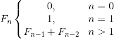
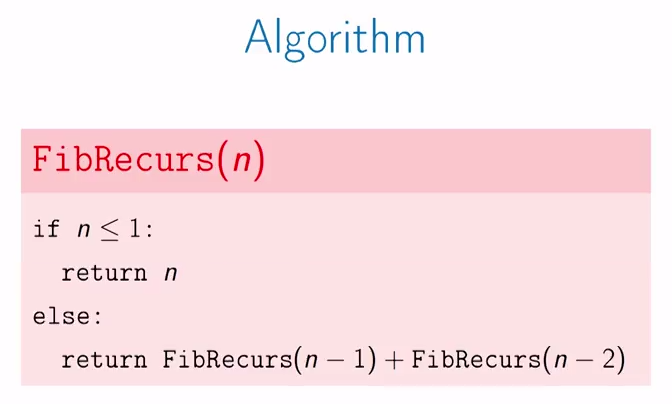
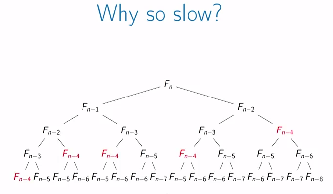
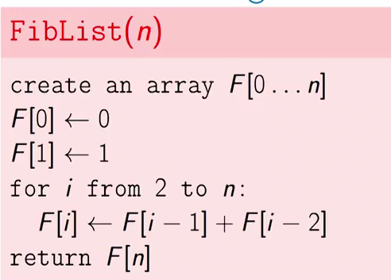

# Fibonacci sequence


### Definition:

```latex
F_{n}\left\{\begin{matrix}
0, & n=0\\
1, & n=1\\
F_{n-1}+F_{n-2} & n>1
\end{matrix}\right.
```



The implementation of this algorithm is as follows:


The recursive Fibbonacci is that slow because it spends time recalculating steps
which were already calculated before. In the next three it's shown in red that
F<sub>n-4</sub> is calculated in five separated occasions.




This algortihm takes too long to get the nth number. for example

## Non-recursive

As we are calculating the same digit many times we can come up with a different
approach, which is mostly like we would do it by hand. We create an array and
we just store the list of the calculated numbers.




https://www.cs.usfca.edu/~galles/visualization/DPFib.html
