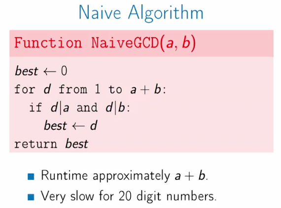

# Gratest Common divisor

## Definition


For integers _a_ and _b_, their greatest common divisor is the largest integer
_d_ so that _d_ divides both _a_ and _b_.


## Naive Algorithm

from 0 to a+b find the max number that divides both a and b.




## The Euclidean Algorithm

For a better Algorithm than the naive, we need this importan lemma:

Let _a'_ be the remainder when _a_ is divided by _b_, then.
* `a' = a % b`
```
gdc(a,b) = gdc(a', b) = gdc(b,a')
```
Then the GDC can be implemented with the next Algorithm:
```
gdc(a, b)
  if b = 0
    return a
  else
    gdc(b, a%b)
```


##### Runtime

- Each step reduces the size of numbers by a factor of 2.
- This takes about `log(a*b)` steps.
- GDC of 100 digit numbers takes about 600 steps.
- finding the correct Algorithm requires known something interesing about the
problem.
